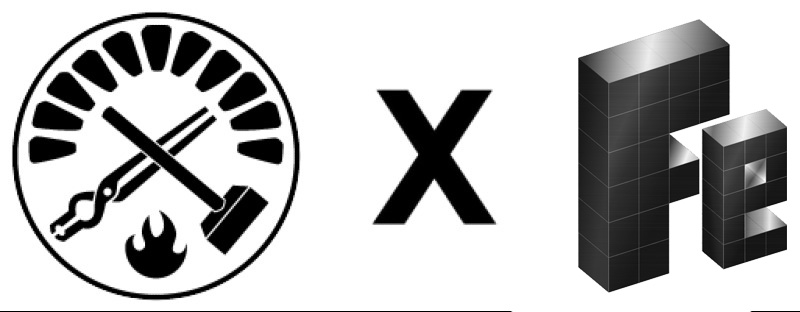

# Foundry x Fe

[](https://opensource.org/licenses/Apache-2.0)

A [Foundry](https://github.com/foundry-rs/foundry) library for working with [Fe](https://github.com/ethereum/fe) contracts.


## Installing

First, install the [Fe compiler](https://fe-lang.org/docs/user-guide/installation.html) by running:
```
brew install fe-lang/tap/fe
```

Then, install this library with [forge](https://github.com/foundry-rs/foundry):
```
forge install cairoeth/foundry-fe
```


## Usage

The FeDeployer is a Solidity library that takes a filename and deploys the corresponding Fe contract, returning the address that the bytecode was deployed to. To use it, simply import it into your file by doing:

```js
import {FeDeployer} from "foundry-fe/FeDeployer.sol";
```

To compile contracts, you can use `FeDeployer.deploy(string fileName)`, which takes in a single string representing the filename's path relative to the `src` directory. Note that the file ending, i.e. `.fe`, must be omitted.
Here is an example deployment (where the contract is located in [`src/test/contracts/Number.fe`](./src/test/contracts/Number.fe)):

```solidity
// SPDX-License-Identifier: Apache-2.0
pragma solidity >=0.7.0 <0.9.0;

import {FeDeployer} from "foundry-fe/FeDeployer";

interface Number {
  function setNumber(uint256) external;
  function getNumber() external returns (uint256);
}

contract FeDeployerExample {
  function deploy() public {
    // Deploy a new instance of src/test/contracts/Number.fe
    address addr = FeDeployer.deploy("test/contracts/Number");

    // To call a function on the deployed contract, create an interface and wrap the address like so
    Number number = Number(addr);
  }
}
```
